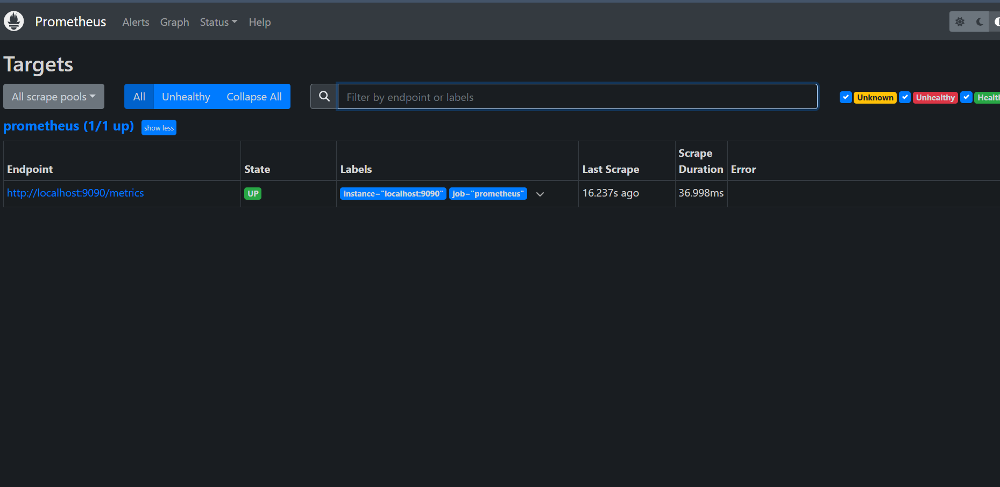
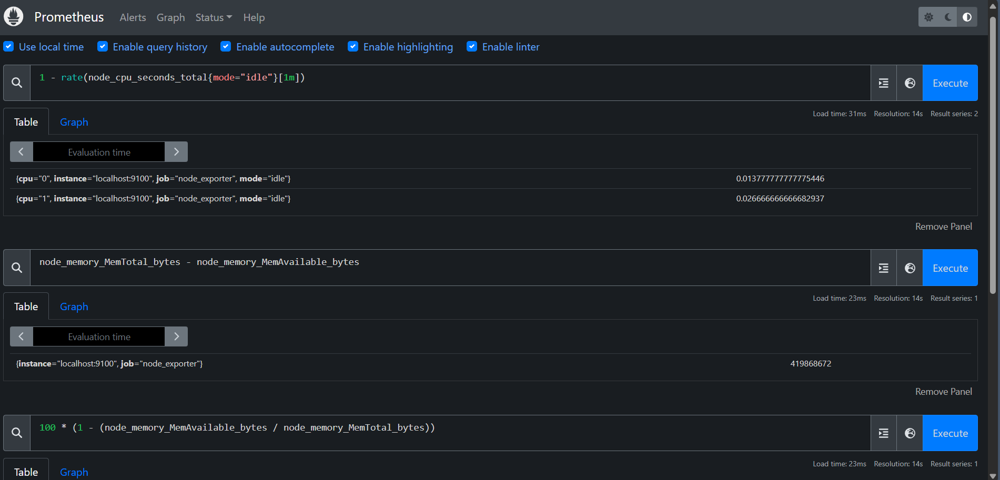
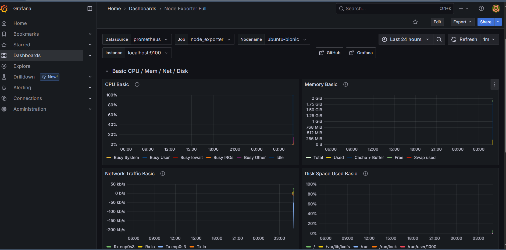
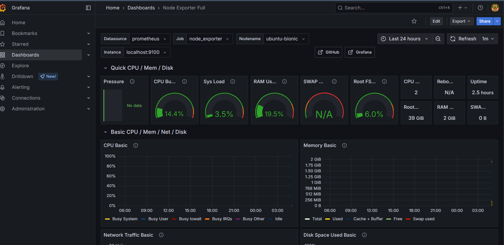

````markdown
# AI & System Monitoring with Prometheus and Grafana

A local DevOps observability project that demonstrates system monitoring using
Prometheus, Node Exporter, and Grafana in an Ubuntu/Vagrant environment.

The project collects system-level metrics, stores them in Prometheus, and
visualizes them through Grafana dashboards.

## Architecture

```text
Ubuntu / Vagrant Environment
            │
            ▼
      Node Exporter
            │
            │ System Metrics
            ▼
        Prometheus
            │
            │ PromQL Queries
            ▼
         Grafana
            │
            ▼
     Monitoring Dashboard
````

## Objective

The objective of this project is to build a local monitoring environment that
can be used to observe system health and performance.

The project demonstrates:

* Metrics collection
* Metrics scraping
* Prometheus configuration
* PromQL queries
* Grafana dashboards
* System observability
* DevOps monitoring concepts

## Technologies

* Ubuntu
* Vagrant
* Prometheus
* Node Exporter
* Grafana
* Bash / Shell
* PromQL

## Project Structure

```text
ai-model-monitoring-devops/
│
├── Vagrantfile
├── prometheus.yml
├── alert.rules.yml
├── dashboards.json
├── install.sh
├── provision.sh
├── README.md
│
└── docs/
    ├── netdata-metrics-overview.png
    ├── prometheus-targets.png
    ├── prometheus-node-metrics.png
    ├── grafana-node-exporter-dashboard.png
    ├── grafana-monitoring-panels.png
    └── grafana-system-metrics.png
```

## Monitoring Stack

### Node Exporter

Node Exporter exposes system-level metrics from the Ubuntu environment.

Examples include:

* CPU metrics
* Memory metrics
* Disk metrics
* Network metrics
* System information

### Prometheus

Prometheus collects and stores the metrics exposed by Node Exporter.

The Prometheus configuration defines the monitoring targets and scrape
configuration.

PromQL queries are used to analyze collected metrics.

### Grafana

Grafana connects to Prometheus as a data source and provides dashboards for
visualizing system performance.

The dashboard includes monitoring views for:

* CPU
* Memory
* Network traffic
* Disk usage
* System processes
* Storage
* Node Exporter metrics

## Monitoring Workflow

```text
System
  ↓
Node Exporter
  ↓
Prometheus Scraping
  ↓
Metric Storage
  ↓
PromQL
  ↓
Grafana
  ↓
Visualization
```

## Example PromQL Queries

### CPU Idle Rate

```promql
rate(node_cpu_seconds_total{mode="idle"}[1m])
```

### Memory Usage

```promql
node_memory_MemTotal_bytes - node_memory_MemAvailable_bytes
```

### Memory Utilization

```promql
100 * (1 - (node_memory_MemAvailable_bytes / node_memory_MemTotal_bytes))
```

## Running the Project

### 1. Start the Vagrant Environment

```bash
vagrant up
```

### 2. Access Prometheus

```text
http://localhost:9090
```

### 3. Access Grafana

```text
http://localhost:3000
```

### 4. Verify Node Exporter

Node Exporter runs on:

```text
http://localhost:9100
```

## Project Results

The monitoring environment successfully demonstrates:

* Prometheus running with an active monitoring target
* Node Exporter exposing system metrics
* PromQL queries for CPU and memory metrics
* Grafana dashboards connected to Prometheus
* Visualization of CPU, memory, network, and disk metrics

## Screenshots

### Prometheus Targets



### Prometheus Node Metrics



### Grafana System Metrics



### Grafana Node Exporter Dashboard



## Key Learning Outcomes

* Understanding monitoring and observability
* Configuring Prometheus scrape targets
* Working with Node Exporter
* Writing PromQL queries
* Building Grafana dashboards
* Monitoring system resources
* Working with Vagrant-based development environments
* Understanding the relationship between metrics collection, storage, and visualization

## Future Improvements

* Add custom application-level metrics
* Add Alertmanager for alert notifications
* Containerize the monitoring stack using Docker Compose
* Add custom Grafana dashboards
* Monitor application and ML-model-specific metrics
* Deploy the monitoring stack to a cloud environment

## Author

**Dinesh Kumar**

Computer Science Engineering
Artificial Intelligence & Data Science

```
